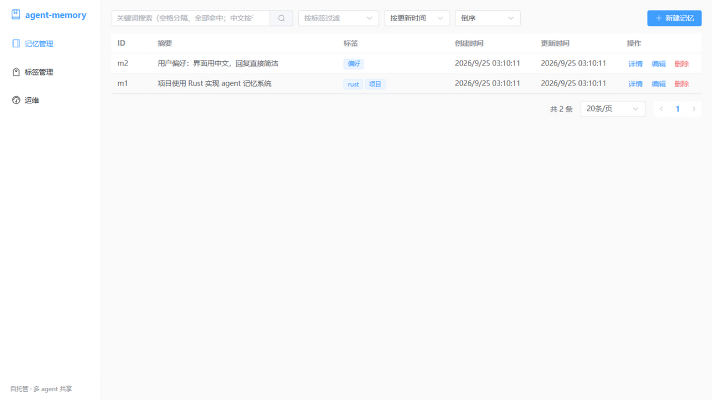
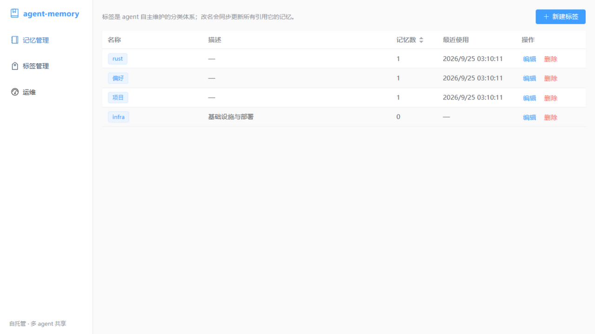
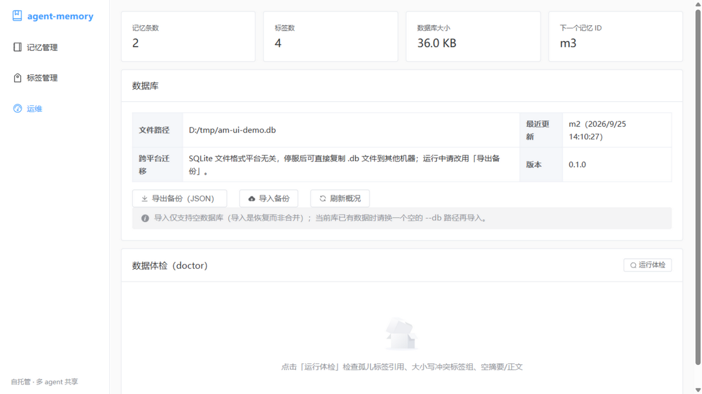

# agent-memory

自托管 MCP 记忆服务器：**一个记忆库服务所有 agent**，多个 AI agent（ZCode / Claude Desktop / Cursor 等）通过网络访问同一份数据，并内置 Vue3 Web 管理界面供人直接浏览与管理。

- **传输**：纯 HTTP——agent 走 MCP Streamable HTTP（`/mcp`），人走浏览器（`/`）
- **存储**：单文件 SQLite（WAL 模式），多 agent / 多进程并发安全
- **跨平台**：SQLite 文件格式平台无关，同一份 `.db` 可在 Windows / Linux / macOS 间直接复制
- **单二进制**：管理界面构建产物嵌入二进制，`cargo build` 即得完整交付物

## 快速开始

```bash
# 从源码安装（产物进入 ~/.cargo/bin，需先 npm install && npm run build 以准备嵌入的界面产物）
cargo install --path .

# 启动（默认 127.0.0.1:8899，数据库在 ~/.agent-memory/memory.db）
agent-memory serve
```

打开 `http://127.0.0.1:8899/` 即是管理界面；让 agent 的 MCP 配置指向 `http://127.0.0.1:8899/mcp` 即接入同一记忆库。

常用命令行参数（无配置文件，全部走参数）：

| 参数 | 默认值 | 说明 |
|---|---|---|
| `--host` | `127.0.0.1` | 监听地址；跨机器共享用 `0.0.0.0`（仅限可信网络） |
| `--port` | `8899` | 监听端口 |
| `--db` | `~/.agent-memory/memory.db` | SQLite 数据库文件路径 |

子命令：`serve`（默认）/ `stats` / `doctor`（体检，有问题退出码 1）/ `export <file>`（导出 JSON 备份，拒绝覆盖已有文件）/ `import <file>`（从备份恢复，要求目标库为空）。

## 接入 MCP 客户端（多 agent 共享）

```json
"agent-memory": { "type": "http", "url": "http://127.0.0.1:8899/mcp" }
```

所有客户端指向同一 URL 即共享同一记忆库，用标签体系区分项目。并发安全由 SQLite WAL + busy_timeout 保证，多进程、多连接同时读写不会互相覆盖。

> ⚠️ 服务器无鉴权：任何能连上该端口的程序都能读写记忆库。跨机器共享时（`--host 0.0.0.0`）务必只暴露给可信网段。内置 Origin 校验防浏览器 DNS rebinding。

## 功能

10 个 MCP 工具（与管理界面共用同一套业务逻辑）：

- **标签管理**：`tag_create` / `tag_list` / `tag_rename` / `tag_delete`——标签有唯一名称 + 可选描述（≤500 字符），分类体系由 agent 自主维护；改名级联同步所有引用；删除分 `detach`（摘引用）与 `purge`（连带删记忆）
- **记忆管理**：`memory_create` / `memory_update` / `memory_delete`
- **渐进式披露**：`memory_list` / `memory_search` 只返回 id + 标签 + 摘要 + 片段；`memory_get` 才取回完整正文，最大限度节省上下文
- **Markdown 正文**：记忆正文推荐用 Markdown 书写（工具描述中已向 agent 声明），管理界面编辑时可预览渲染结果，详情抽屉默认渲染、可切回源码；渲染前经 DOMPurify 消毒，多 agent 共写的恶意内容不会在管理界面执行
- **关键词搜索**：空格分词、全部词命中（AND），引号短语要求逐字相邻；大小写不敏感子串匹配，中文无需分词；加权排序——标签 > 摘要 > 正文，命中次数（封顶）与 ASCII 整词命中加权，片段窗口自动选覆盖词最多的位置；片段经 HTML 转义
- **防呆提示**：重复摘要 → `duplicate_of`；仅大小写不同的标签 → `similar_existing`；拼错参数名 → 立即报错并列出合法参数

## 管理界面

- **记忆管理**：搜索、标签过滤、排序、分页、新建/编辑（标签回车即建、正文 Markdown 编辑/预览切换）、全文抽屉（渲染/源码切换）、删除确认
- **标签管理**：表格 + 新建/编辑（名称唯一、描述限长）+ 删除时选择 detach/purge
- **运维**：统计卡片、doctor 体检、一键导出 JSON 备份







## 性能

本机实测（Windows，2026-09，300 条记忆）：单次创建 ~23 ms，搜索/分页 ~10 ms。写入成本随条目数近似线性，数千条以内完全无感，上万条仍可用。

## 数据

- 数据保存在单个 SQLite 文件（默认 `~/.agent-memory/memory.db`）
- **跨机器迁移**：SQLite 文件格式平台无关，服务器停止后直接复制 `.db` 即可换机使用（Windows / Linux / macOS 通用）；需要可读格式时用 `export` + `import` 完成"导出 → 恢复"
- **数据安全**：每个请求在单个事务内执行，错误时自动回滚，磁盘数据保持原样

## 许可

| 工具 | 只读 | 说明 |
|---|---|---|
| `tag_create(name, description?)` | | 新建标签，重名报错；存在仅大小写不同的标签时在 `similar_existing` 里提示（非阻塞） |
| `tag_list()` | ✓ | 全部标签 + 描述 + 记忆计数 + 最近使用时间 |
| `tag_rename(old_name, new_name?, description?)` | | 重命名（级联同步所有引用）/ 改描述 |
| `tag_delete(name, mode?)` | | `detach`（默认，只摘引用）/ `purge`（连带删除记忆） |
| `memory_create(summary, content, tags?)` | | 新建记忆；未知标签自动创建并在 `tags_autocreated` 汇报；摘要重复时提示 `duplicate_of` |
| `memory_list(tag?, sort?, order?, offset?, limit?)` | ✓ | 分页浏览，只返回摘要 |
| `memory_search(query, tags?, offset?, limit?)` | ✓ | 关键词搜索，返回摘要 + 正文片段，支持翻页 |
| `memory_get(ids)` | ✓ | 取 1–50 条完整正文（渐进式披露第二层） |
| `memory_update(id, summary?, content?, add_tags?, remove_tags?)` | | 增量更新，无需先取当前标签列表 |
| `memory_delete(ids)` | | 永久删除 1–50 条 |

## 推荐的 agent 使用方式

1. **存**：`memory_create`，摘要写得精确自洽（未来扫描全靠它），标签自选自管
2. **查**：先 `memory_search` / `memory_list`（便宜），再对值得读的 id 调 `memory_get`（贵）
3. **管**：定期 `tag_list` 检查分类体系，用 `tag_rename` 纠错，过期记忆用 `memory_delete` 清理

## 许可

MIT（见 [LICENSE](LICENSE)）。
